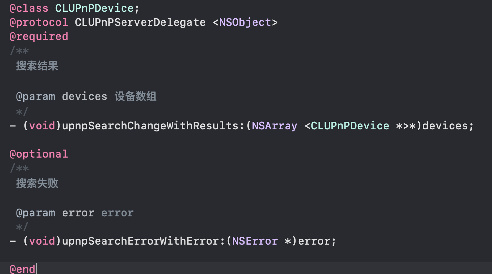
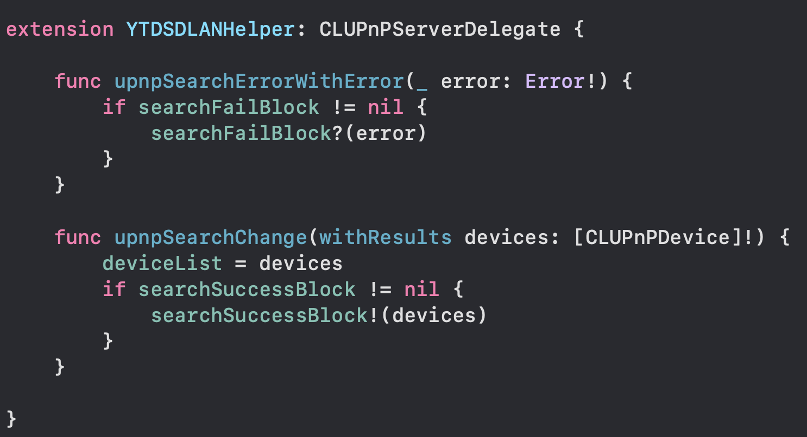

在OC文件定义一个protocol，有一个通过@class声明的类CLUPnPDevice

如果要在swift文件里实现这个protocol，如下

在开始编码过程遇到的问题:  一直报错<u>Type "YTDSDLANHelper" cannot conform to protocol "CLUPnPServerDelegate" because it has requirements that cannot be satisfied</u>，错误提示是有@required修饰的方法没有实现，根据提示将@required修饰的方法添加上，这时会出现报错<u>xxxmethod may not available in this context</u>，提示不能添加该方法。

最后是通过将在OC文件定义的protocol引用的所有类的头文件都包含项目的bridging header，上述报错才能得到解决。
